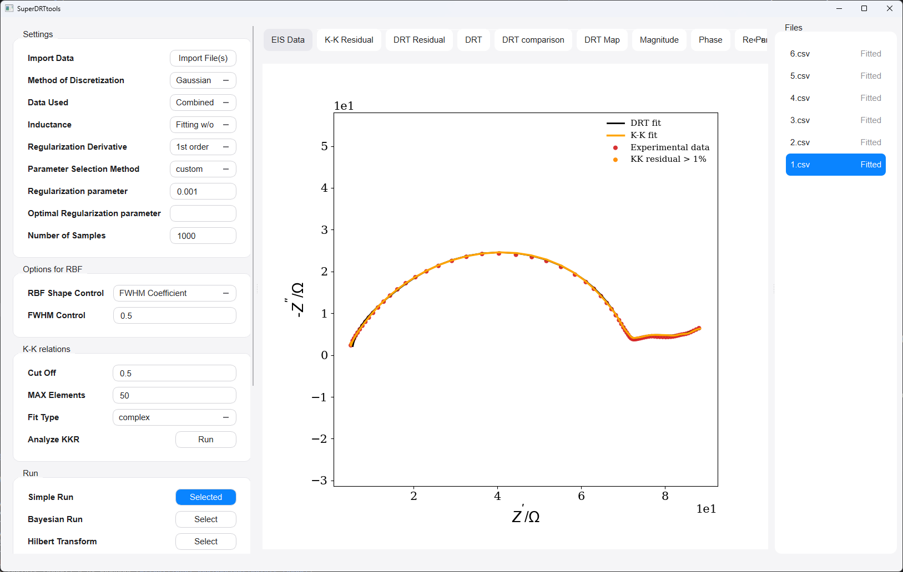
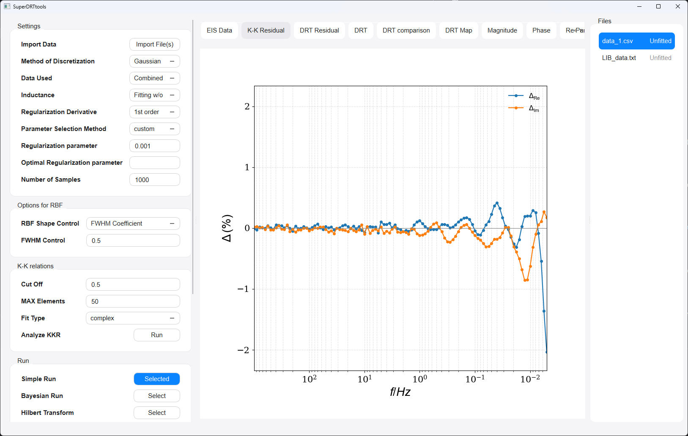
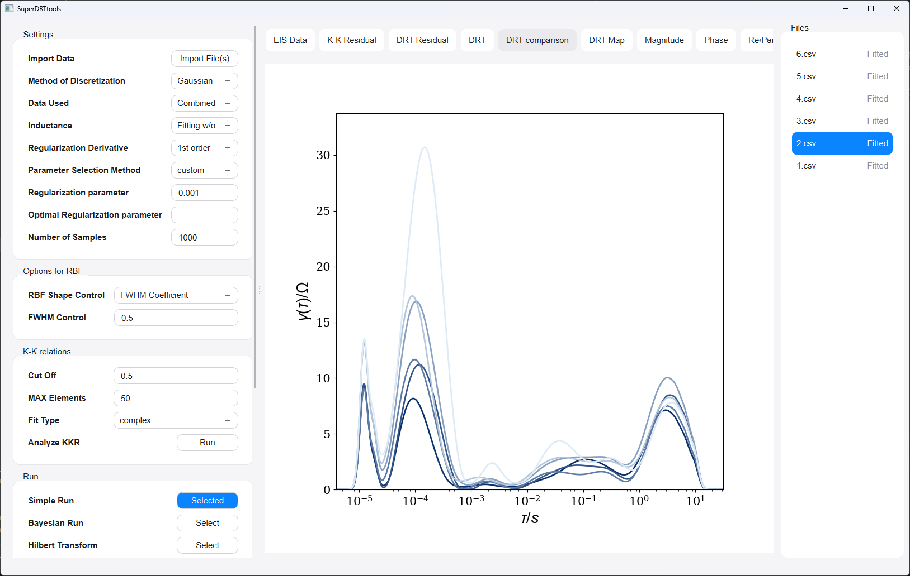
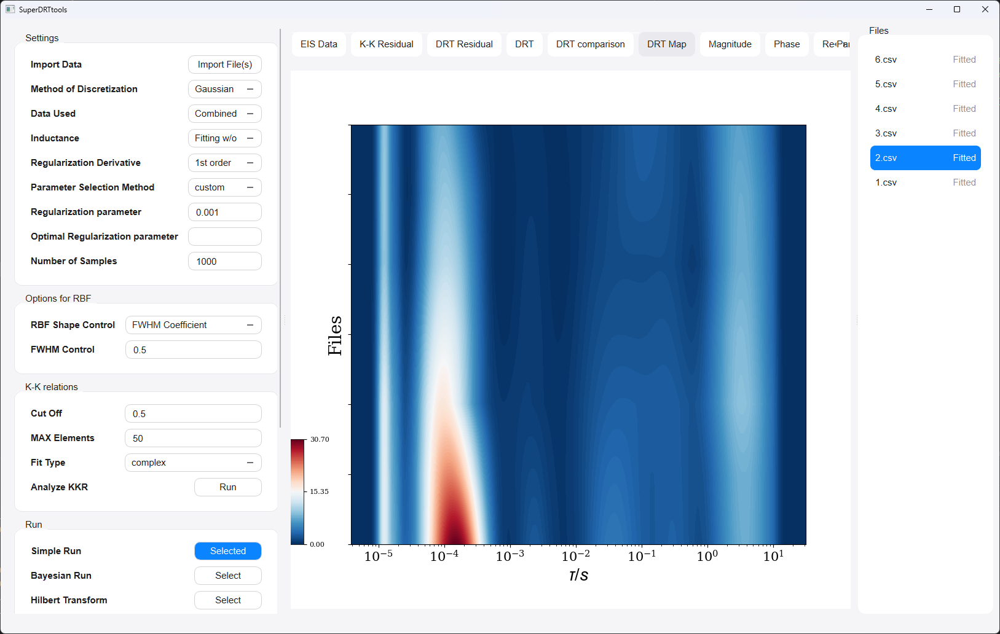

# SuperDRTtools V1.1

<div align="center">

**A modern GUI toolbox for DRT, KK validation, masking, and EIS quality assessment**

*Built for electrochemical impedance spectroscopy (EIS) analysis with an intuitive multi-file workflow.*


</div>

---

## Overview

**SuperDRTtools** is an enhanced GUI toolbox for analyzing **electrochemical impedance spectroscopy (EIS)** data via the **distribution of relaxation times (DRT)** framework.

It extends the original pyDRTtools workflow with a more practical desktop-oriented experience for real experimental datasets, including:

- multi-file import and batch fitting
- Kramers–Kronig (K-K) validation based on `linKK`
- residual-aware EIS inspection
- point masking for suspicious data
- DRT comparison and DRT map visualization
- Hilbert-transform-based quality scoring
- simple and Bayesian DRT workflows

The goal of SuperDRTtools is not only to compute DRT, but also to make **data quality control, exception handling, and batch analysis** much easier in daily research use.

---

## Highlights

<table>
<tr>
<td width="50%" valign="top">

### DRT workflows
- Tikhonov-based DRT computation
- Bayesian credible-interval workflow
- Peak analysis / deconvolution tools
- Multiple parameter-selection strategies

</td>
<td width="50%" valign="top">

### Data-quality workflows
- K-K validation with `linKK`
- K-K residual visualization
- Residual-aware point highlighting
- Manual and rule-based masking

</td>
</tr>
<tr>
<td width="50%" valign="top">

### Practical GUI features
- Multi-file list and status tracking
- Fit one / fit all workflows
- DRT comparison overlay
- DRT heatmap (DRT Map)

</td>
<td width="50%" valign="top">

### Inspection & export
- EIS / magnitude / phase / Re / Im views
- DRT residual visualization
- Figure export
- DRT and EIS result export

</td>
</tr>
</table>

---

## Screenshots

### Main interface


### EIS Data with K-K fit / residual-aware points / masking


### DRT comparison and DRT map



---

## What SuperDRTtools can do

### 1. Analyze EIS using DRT
SuperDRTtools provides a Python GUI for computing the **distribution of relaxation times (DRT)** from impedance spectra. It supports classical regularized DRT workflows as well as Bayesian inference routes.

### 2. Run K-K validation before interpretation
The software includes a **Kramers–Kronig validation** workflow using `linKK`, allowing users to inspect whether imported EIS data are sufficiently self-consistent before DRT interpretation.

### 3. Inspect suspicious points directly in the EIS plot
After K-K analysis, the **EIS Data** view can be used to inspect raw experimental points together with K-K information. Suspicious points can be visually flagged and masked for subsequent DRT fitting.

### 4. Work with multiple files efficiently
Instead of handling only one spectrum at a time, SuperDRTtools supports **multi-file import**, file ordering, fit-status tracking, batch fitting, DRT comparison, and DRT map visualization.

### 5. Evaluate data quality with Hilbert-transform tools
The Hilbert-transform / Bayesian quality-assessment functionality from the original project is preserved for scoring EIS consistency and related regression outputs.

---

## Current feature set

### Core analysis modes
- Simple DRT run
- Bayesian DRT run
- Hilbert Transform run
- Peak analysis

### K-K workflow
- K-K validation using `linKK`
- K-K residual plot
- K-K fit overlay in EIS Data
- Residual-aware point coloring

### EIS masking workflow
- Manual point masking from EIS Data
- Box-selection for multiple points
- Frequency-range / residual-threshold masking rules
- Masked points shown with reduced opacity

### Visualization
- EIS Data
- K-K Residual
- Magnitude
- Phase
- Re Part
- Im Part
- DRT Residual
- DRT
- DRT comparison
- DRT Map
- EIS Score

### Multi-file workflow
- Import multiple `.csv` / `.txt` files
- File list with fitted / unfitted status
- Fit One / Fit All
- Reorder spectra in the file list
- Batch-oriented visualization order

---

## Recommended analysis logic

A practical workflow for impedance analysis in SuperDRTtools is:

1. **Import EIS data**
2. Adjust **Inductance** handling if needed
3. Run **K-K validation**
4. Inspect K-K residuals and suspicious points in **EIS Data**
5. Mask obvious abnormal points if necessary
6. Re-run **K-K validation** if you want updated residuals after masking
7. Perform **DRT fitting using the remaining raw data**

### Important note
SuperDRTtools is configured so that **DRT fitting is performed on the current raw / retained EIS data**, not on K-K-fitted data. K-K is used as a **validation and inspection step**, not as the default DRT input replacement.

---

## Installation

### Requirements

To install and run SuperDRTtools, you need:

- Python >= 3
- A desktop environment capable of running PyQt5

### Recommended environment setup (Anaconda)

```bash
conda create --name SuperDRTtools python=3.10 pip ipython pandas matplotlib scikit-learn spyder
conda activate SuperDRTtools
pip install cvxopt PyQt5 impedance pyinstaller
```

If your local package structure requires it, also make sure the project dependencies used by the original pyDRTtools codebase are installed in the same environment.

---

## Quick start

### Run from source

From the project root:

```bash
python launch.py
```

---

## Project structure

A typical project layout is expected to look like this:

```text
SuperDRTtools/
├─ launch.py
├─ pyDRTtools/
│  ├─ __init__.py
│  ├─ GUI.py
│  ├─ layout.py
│  ├─ basics.py
│  ├─ parameter_selection.py
│  ├─ runs.py
│  └─ ...
├─ manual/
├─ docs/
│  └─ images/
└─ README.md
```

---

## Packaging to EXE

You can package SuperDRTtools into a Windows executable using **PyInstaller**.

### Basic command

```bash
python -m PyInstaller --noconfirm --clean --windowed --onefile --name SuperDRTtools launch.py
```

### Notes

- Use `python -m PyInstaller`
- If the packaged EXE reports missing hidden imports, add `--hidden-import` or `--collect-submodules` as needed.
- During debugging, you may temporarily remove `--windowed` to see console traceback output.

### Example with hidden-import fixes

```bash
python -m PyInstaller --noconfirm --clean --windowed --onefile --name SuperDRTtools \
  --hidden-import=sklearn.externals.array_api_compat.numpy.fft \
  --collect-submodules=sklearn.externals.array_api_compat.numpy \
  launch.py
```

---

## User manual

For detailed usage guidance, installation notes, and background information, please consult the user manual:

- [manual](docs/manual/pyDRTtools_manual.pdf)

---

## Why this project may be useful

SuperDRTtools is designed for users who want more than a minimal DRT GUI. It is especially useful if you need to:

- inspect and clean real experimental EIS datasets
- compare many impedance spectra efficiently
- combine K-K validation with DRT interpretation
- work with Bayesian and HT-based quality-assessment workflows
- prepare figures and exported results for research use

---

## How to cite this work?

[1] Wan, T. H., Saccoccio, M., Chen, C., & Ciucci, F. (2015). Influence of the discretization methods on the distribution of relaxation times deconvolution: implementing radial basis functions with DRTtools. Electrochimica Acta, 184, 483-499.*

Link: https://doi.org/10.1016/j.electacta.2015.09.097

if you want to add more details about standard regularization methods for computing the regularization parameter used in ridge regression, you should also cite the following references:

[2] A. Maradesa, B. Py, T.H. Wan, M.B. Effat, F. Ciucci, Selecting the Regularization Parameter in the Distribution of Relaxation Times, Journal of the Electrochemical Society, 170 (2023) 030502.

Link: https://doi.org/10.1149/1945-7111/acbca4

if you are presenting the *Bayesian credible intervals* generated by the pyDRTtools in any of your academic works, you should cite the following references also:

[3] Ciucci, F., & Chen, C. (2015). Analysis of electrochemical impedance spectroscopy data using the distribution of relaxation times: A Bayesian and hierarchical Bayesian approach. Electrochimica Acta, 167, 439-454.

Link: https://doi.org/10.1016/j.electacta.2015.03.123

[4] Effat, M. B., & Ciucci, F. (2017). Bayesian and hierarchical Bayesian based regularization for deconvolving the distribution of relaxation times from electrochemical impedance spectroscopy data. Electrochimica Acta, 247, 1117-1129.

Link: https://doi.org/10.1016/j.electacta.2017.07.050

if you are using the pyDRTtools to compute the *Hilbert Transform*, you should cite:

[5] Liu, J., Wan, T. H., & Ciucci, F. (2020).A Bayesian view on the Hilbert transform and the Kramers-Kronig transform of electrochemical impedance data: Probabilistic estimates and quality scores. Electrochimica Acta, 357, 136864.

Link: https://doi.org/10.1016/j.electacta.2020.136864


# References:
1. Ciucci, F. (2020). The Gaussian process Hilbert transform (GP-HT): Testing the Consistency of electrochemical impedance spectroscopy data. Journal of The Electrochemical Society, 167, 12, 126503. [https://doi.org/10.1149/1945-7111/aba937](https://doi.org/10.1149/1945-7111/aba937)
2. Liu, J., Wan, T. H., & Ciucci, F. (2020).A Bayesian view on the Hilbert transform and the Kramers-Kronig transform of electrochemical impedance data: Probabilistic estimates and quality scores. Electrochimica Acta, 357, 136864. [https://doi.org/10.1016/j.electacta.2020.136864](https://doi.org/10.1016/j.electacta.2020.136864)
3. Ciucci, F. (2019). Modeling electrochemical impedance spectroscopy. Current Opinion in Electrochemistry, 13, 132-139. [doi.org/10.1016/j.coelec.2018.12.003](https://doi.org/10.1016/j.coelec.2018.12.003)
4. Saccoccio, M., Wan, T. H., Chen, C., & Ciucci, F. (2014). Optimal regularization in distribution of relaxation times applied to electrochemical impedance spectroscopy: ridge and lasso regression methods-a theoretical and experimental study. Electrochimica Acta, 147, 470-482. [doi.org/10.1016/j.electacta.2014.09.058](https://doi.org/10.1016/j.electacta.2014.09.058)
5. Wan, T. H., Saccoccio, M., Chen, C., & Ciucci, F. (2015). Influence of the discretization methods on the distribution of relaxation times deconvolution: implementing radial basis functions with DRTtools. Electrochimica Acta, 184, 483-499. [doi.org/10.1016/j.electacta.2015.09.097](https://doi.org/10.1016/j.electacta.2015.09.097)
6. Ciucci, F., & Chen, C. (2015). Analysis of electrochemical impedance spectroscopy data using the distribution of relaxation times: a Bayesian and hierarchical Bayesian approach. Electrochimica Acta, 167, 439-454. [doi.org/10.1016/j.electacta.2015.03.123](https://doi.org/10.1016/j.electacta.2015.03.123)
7. Effat, M. B., & Ciucci, F. (2017). Bayesian and hierarchical Bayesian based regularization for deconvolving the distribution of relaxation times from electrochemical impedance spectroscopy data. Electrochimica Acta, 247, 1117-1129. [doi.org/10.1016/j.electacta.2017.07.050](https://doi.org/10.1016/j.electacta.2017.07.050)
8. Liu, J., & Ciucci, F. (2019). The Gaussian process distribution of relaxation times: a machine learning tool for the analysis and prediction of electrochemical impedance spectroscopy data. Electrochimica Acta, 135316. [doi.org/10.1016/j.electacta.2019.135316](https://doi.org/10.1016/j.electacta.2019.135316)
9. Liu, J., & Ciucci, F. (2020). The deep-prior distribution of relaxation times. Journal of The Electrochemical Society, 167(2), 026506. [10.1149/1945-7111/ab631a](https://iopscience.iop.org/article/10.1149/1945-7111/ab631a/meta)
10. A. Maradesa, B. Py, T.H. Wan, M.B. Effat, F. Ciucci, Selecting the Regularization Parameter in the Distribution of Relaxation Times, Journal of the Electrochemical Society, 170 (2023) 030502.
Link: https://doi.org/10.1149/1945-7111/acbca4


**How to get support?**

Just write to francesco.ciucci@ust.hk or francesco.ciucci@uni-bayreuth.de
